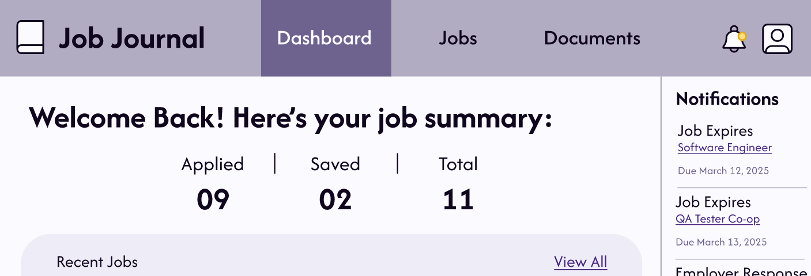

## About the Project
**Job Journal** is document and job application management tool designed to increase organization, motivation, and productivity. 
The targetted user group are students and people with less than 2 years of experience, looking for internships or permanent jobs in technical 
fields. Through user research, many painpoints were identified and the following problem statement was defined:

> Our users have difficulty managing positions of interest, submitted applications and their statuses,
> cover letters, resumes, job descriptions, job IDs, as well as all other documentation created during the application process.

As the term project for *CISC325: Human-Computer Interaction*, this project followed a **user-centered design process**. 
We began by conducting user research interviews with our target group and using the findings to design 
an interactive paper prototype. Mi-fi iterations were then created based on user evaluations, culminating in a 
final [hi-fi Figma prototype](https://www.figma.com/proto/ezbJvZY9OlSEWEEaJc0kzS/Job-Journal--G45-?node-id=196-617&p=f&t=7PXrSxY57us4Wadw-1&scaling=contain&content-scaling=fixed&page-id=0%3A1&starting-point-node-id=196%3A617&show-proto-sidebar=1) of the tool.

Findings and iterations of Job Journal are documented in the proposal and various reports. Progress was also presented
through two live presentations demoing the paper prototype and future iterations. The silent
demo videos can be viewed here:
- [Low-Fi Demo](https://youtu.be/M90o1wo-cXU)
- [Hi-Fi Demo](https://www.youtube.com/watch?v=tZiwKonP8Yo)
